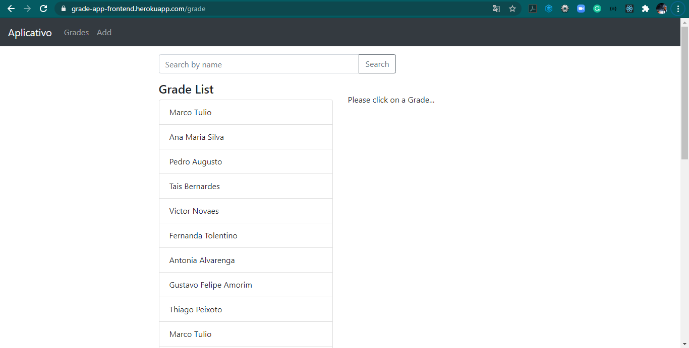

[PT-BR]

# Projeto FullStack Grades-APP - Bootcamp IGTI Desafio Módulo 4

Professor: Bruno Augusto Teixeira. 
Aluno: Felipe Marques.

## :memo: Status:

- Concluído.

## :dart: Objetivo:

Exercitar conceitos trabalhados no Módulo 1 do Bootcamp Dev Full Stack como:

- Exercitar os conceitos trabalhados no módulo para a criação de um modelo de
  dados com o mongoose. 
- Praticar os conceitos de versionamento de código e implantação pelo Heroku. 

## Imagem do Projeto

## :octocat: Deploy no Heroku:

[Deploy](https://grade-app-frontend.herokuapp.com/)
